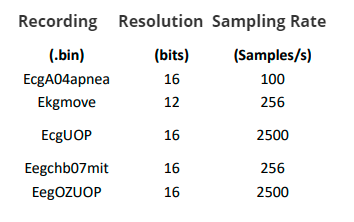
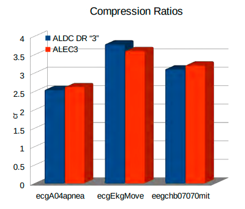
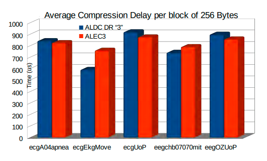
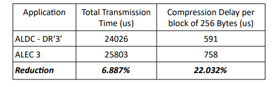

**Adaptive Lossless Electrocardiogram Compression Algorithm with Decision Regions**
**by Palaiologos Efstathios**

<<<<<<< HEAD
This C implementation of the ALEKGC-DR algorithm is part of an already completed and evaluated study. 
=======
C implementation

This implementation of the ALEKGC-DR algorithm is part of an
already completed and evaluated study. 
>>>>>>> e8939b61908c8f4482243ce3158c48bf4a0033e6
https://nemertes.lis.upatras.gr/jspui/handle/10889/12953

This version targets to demonstrate the benefits of the modifications that were applied to the basic ALDC algorithm in order to improve its overall performance when compressing EKGs.

**Benchmarks on MIT ARYTMIA DATABASE**

https://ieeexplore.ieee.org/document/8418357

| Entropy Encoding                                             | Compression Ratio |
| ------------------------------------------------------------ | :---------------: |
| **Proposed: ALDC "3" (Hybrid Single-1 stage Huffman - Multiple Two Stage Huffman with Linear Prediction)** |     **3.13**      |
| Golomb-Rice Coding                                           |       2.38        |
| Fixed length Coding                                          |       2.38        |
| Fixed length  Coding with LMS predictor                      |       2.28        |
| Two- Stage Huffman Coding                                    |       2.53        |
| Huffman Coding                                               |       1.92        |
| Modified Variable Length Coding                              |       2.67        |
| Huffman Coding with Fan Algorithm                            |       2.10        |
| Content-Adaptive Golomb-Rice Coding                          |       2.77        |

**Benchmarks on Custom Dataset under Real-Time Operation of  STM32F407VGT(84MHz) :** **

The Evaluation of the Proposed Compression Algorithms  is performed using a Real-Time "Receipt--Compression--Transmission" scenario

****

