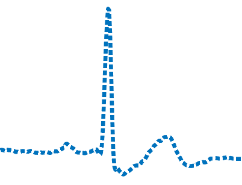
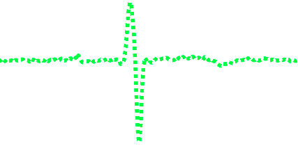

# An Adaptive Lossless Data Compression Algorithm Optimised for ECGs

Documentation page : https://stathpale.github.io/ALDC_EKG/html/index.html

**by Palaiologos Efstathios**

## What is this repository about ?

This C implementation of the ALDC-DR-EKG algorithm is part of an already completed and evaluated research and targets to demonstrate the benefits of the modifications that were applied to the basic ALDC-DR algorithm in order to improve its overall performance when compressing ECGs on the fly.

https://nemertes.lis.upatras.gr/jspui/handle/10889/12953

## Why should we compress an ECG signal on the fly?

1. Compression contributes significantly to energy savings of mobile medical devices
2. Compressed information requires transmission channels with a smaller bandwidth.
3. Faster Transmission
4. Reduction of traffic in the transmission medium.

## What is different in this algorithm ?

### *It has the best trade-off  between compression ratio and computational delay because it compresses with more Huffman tables only when its necessary*

Take a look how it works :

1. It takes  a part of the signal  

   

2. It calculates the sequential difference of all the samples in that part  

   

3. it calculates the sum of the absolute values of that part  

   *if **sum** is very small* 

     -it compresses that part with LEC encoder  (**1 Huffman Table**) 

   *else*

     -it splits that part to even smaller parts

     -it compresses every smaller part with ALEC3 encoder (**3 Huffman Tables**) 

     -it keeps as the compressed version, the shorter bit stream among the 3

   

   

## What we achieved?

**Benchmarks on the MIT ARYTHMIA DATABASE**

https://ieeexplore.ieee.org/document/8418357

| Entropy Encoding                                             | Compression Ratio |
| ------------------------------------------------------------ | :---------------: |
| **Proposed: ALDC "3" (Hybrid Single-1 stage Huffman - Multiple Three Stage Huffman with Decision Regions** |     **3.13**      |
| Golomb-Rice Coding                                           |       2.38        |
| Fixed length Coding                                          |       2.38        |
| Fixed length  Coding with LMS predictor                      |       2.28        |
| Two- Stage Huffman Coding                                    |       2.53        |
| Huffman Coding                                               |       1.92        |
| Modified Variable Length Coding                              |       2.67        |
| Huffman Coding with Fan Algorithm                            |       2.10        |
| Content-Adaptive Golomb-Rice Coding                          |       2.77        |

**Benchmarks on Custom Dataset under Real-Time Operation of STM32F407VGT(84MHz) :**

The Evaluation of the Proposed Compression Algorithms  is performed using a Real-Time "Receipt--Compression--Transmission" scenario

**On  ekgmove dataset  :**

## What's  inside  this repo

1. Three variations of ALDC Encoder 
   - Hybrid ALEC3 and LEC
   - Hybrid ALEC3 and ALEC2
   - Hybrid ALEC2 and LEC

2. Two variations of  ALEC Encoder 
   - with 2 Huffman tables
   - with 3 Huffman tables

3. The Classic LEC encoder

## How to get Started 

 Clone the directory into your system ( you may ignore the docs folder)

1.  Read the documentation page https://stathpale.github.io/ALDC_EKG/html/index.html to see the available compilation options

2.  Compile on linux   : 

   - clang -O3 -Wall -std=c99 -o alekgc-dr aldc_encoder.c lectools.c fio.c -D \_\_ALDC\_3\_1\_\_ && ./alekgc-dr  
   - gcc -O3 -Wall -std=c99 -o alekgc-dr aldc_encoder.c lectools.c fio.c -D \_\_ALDC\_3\_1\_\_ && 	./alekgc-dr 

3. Compile on Windows either with clang or with VS

   

If you would like to give it a go contact me for the decoder at stathpale@gmail.com

****

